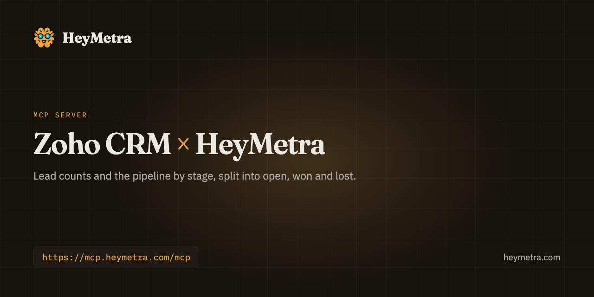

<div align="center">



# Zoho CRM &times; HeyMetra

**Lead counts and the pipeline by stage, split into open, won and lost.**

Your pipeline lives in Zoho CRM. What it cost to fill it lives somewhere else entirely. Ask once, across both.

[](https://registry.modelcontextprotocol.io/v0/servers/com.heymetra%2Fheymetra/versions)
[](https://modelcontextprotocol.io/)
[](https://heymetra.com/security/)
[](https://heymetra.com/connectors/zoho-crm/)

```
https://mcp.heymetra.com/mcp
```

</div>

---

## Ask it things like

> How many leads came in this week, and where did they come from?

> Which owner took the most leads last month?

> In the leads that came in this week, which service did people ask about?

> What is the open pipeline worth, and how much have we already won?

> How many open deals carry no amount at all?

> Which fields do our leads carry that we could group a report by?

> What subjects came up most in our call notes this month?

No dashboard, no export, no query language. You ask in the assistant you already use and the answer comes back with the account it came from.

## Connect Zoho CRM

1. Choose Zoho CRM on the Connections screen in HeyMetra.
2. Sign in on Zoho's own screen with an account that can read the CRM. Your password stays with Zoho.
3. Review the scopes Zoho shows and grant read access.
4. Add HeyMetra to your MCP client — Claude, ChatGPT, Cursor or Codex — with the details HeyMetra gives you.
5. The Zoho CRM tools appear in that client and answer from the live CRM.

## Then add HeyMetra to your assistant

Add HeyMetra once and it is there in every conversation. The address is the same everywhere:

```
https://mcp.heymetra.com/mcp
```

### One command

```bash
npx add-mcp https://mcp.heymetra.com/mcp
```

[`add-mcp`](https://www.npmjs.com/package/add-mcp) is a third-party installer that writes the configuration for Claude Code, Codex, Cursor, Antigravity, VS Code and seventeen other agents. It infers the name from the address, so the server lands as `heymetra`. Run against this endpoint before it was written here.

### Or by hand

<details>
<summary><b>Claude</b> — Settings → Customize → Connectors → Add custom connector</summary>

Paste the address above into Settings → Customize → Connectors → Add custom connector.

_On Team and Enterprise plans only an owner can add it, under Organization settings._

Full walkthrough: [heymetra.com/mcp/claude/](https://heymetra.com/mcp/claude/)
</details>

<details>
<summary><b>ChatGPT</b> — Settings → Security and login → Developer mode, then chatgpt.com/plugins</summary>

Paste the address above into Settings → Security and login → Developer mode, then chatgpt.com/plugins.

_The endpoint has to include its /mcp path here._

Full walkthrough: [heymetra.com/mcp/chatgpt/](https://heymetra.com/mcp/chatgpt/)
</details>

<details>
<summary><b>Grok</b> — grok.com/connectors → New Connector → Custom</summary>

Paste the address above into grok.com/connectors → New Connector → Custom.

_XAI calls this “bring your own MCP”._

Full walkthrough: [heymetra.com/mcp/grok/](https://heymetra.com/mcp/grok/)
</details>

<details>
<summary><b>Perplexity</b> — Settings → Connectors → Custom connector → Remote</summary>

Paste the address above into Settings → Connectors → Custom connector → Remote.

_Perplexity documents it as a Pro, Max and Enterprise feature._

Full walkthrough: [heymetra.com/mcp/perplexity/](https://heymetra.com/mcp/perplexity/)
</details>

<details>
<summary><b>Claude Code</b> — claude mcp add --transport http</summary>

```bash
claude mcp add --transport http heymetra https://mcp.heymetra.com/mcp
```

_Or a .mcp.json in the project root; /mcp inside a session shows what connected._

Full walkthrough: [heymetra.com/mcp/claude-code/](https://heymetra.com/mcp/claude-code/)
</details>

<details>
<summary><b>Codex</b> — ~/.codex/config.toml</summary>

```toml
[mcp_servers.heymetra]
url = "https://mcp.heymetra.com/mcp"
```

_Under an [mcp_servers.<name>] section, then codex mcp login._

Full walkthrough: [heymetra.com/mcp/codex/](https://heymetra.com/mcp/codex/)
</details>

<details>
<summary><b>Cursor</b> — ~/.cursor/mcp.json, or .cursor/mcp.json in a project</summary>

```json
{
  "mcpServers": {
    "heymetra": { "url": "https://mcp.heymetra.com/mcp" }
  }
}
```

_Leave the static OAuth fields empty — they exist for servers that cannot register themselves._

Full walkthrough: [heymetra.com/mcp/cursor/](https://heymetra.com/mcp/cursor/)
</details>

<details>
<summary><b>Antigravity</b> — ~/.gemini/config/mcp_config.json, or .agents/mcp_config.json in a project</summary>

```json
{
  "mcpServers": {
    "heymetra": { "serverUrl": "https://mcp.heymetra.com/mcp" }
  }
}
```

_The key is serverUrl, not url — the one every other JSON client spells differently._

Full walkthrough: [heymetra.com/mcp/antigravity/](https://heymetra.com/mcp/antigravity/)
</details>

## What it may and may not touch

Zoho CRM is a read-only source — HeyMetra reads it to answer questions and never changes the account.

Permissions are switched on per connection, and one you leave off is a tool your assistant never sees.

| Permission | What it covers | Changes anything? |
|---|---|---|
| **Included with the connection** | What connecting Zoho CRM is for. It cannot be switched off on its own — removing the connection is how you withdraw it. | No, read only |
| **Leads** | Read leads, sources, and statuses. | No, read only |
| **Lead records and what people wrote** | Read each lead with its own field values, including free text. | No, read only |
| **Deals** | Read the pipeline and deal values. | No, read only |
| **Notes and call logs** | Read what notes are about and who wrote them, without their text. | No, read only |
| **What the notes actually say** | Read the full text of each note, exactly as your team wrote it. Note bodies are free text about your own customers and often name them, with phone numbers, addresses, and health or other sensitive details. Switching this on sends that text to your AI assistant, which is a third party to the people it describes — and you are the one responsible for it. Off unless you turn it on. | No, read only |

<details>
<summary>What each permission lets an assistant do, in full</summary>

- Lists your CRM's modules and one module's fields, your own custom ones included, with their labels and picklist values. It reads no record of anybody's.
- Counts the leads that came in over a period and groups them by source, status, owner, day, or any field your Leads module carries. No lead's own answers.
- Returns each lead from a period with its own values: the name, the phone number, the email address and whatever the person typed, custom fields included.
- Reads your deals by stage — open, won, lost — and what each stage is worth, stating the currency rather than adding several together.
- Reads the connector's own API response exactly as it arrived — nothing converted, checked or compared — behind the same permission as the tool it repeats. Paid plans only.
- Counts call notes by subject, author, owner or day — and, while the note- bodies permission is on, returns what each note says, in your staff's own words.
</details>

## What HeyMetra reads from Zoho CRM

Connect the CRM once and your MCP client can read it: lead counts for a period grouped by source, status, owner, day, or any field your own Leads module carries — the custom ones your team added included; every deal by stage, split into open (the forecast), won (revenue already realised) and lost, each with the value of the deals that state an Amount; the list of fields your own modules carry, custom ones included, so a report can be built on the fields this organisation actually uses; and, if you switch that permission on, what your call notes are about and who has been writing them, with the text of each note behind a second switch of its own. Deals with no Amount are counted, not valued, and the answer says how many — a pipeline is not worth less because somebody left a field empty. Read-only: no tool changes a record.

<details>
<summary>About Zoho CRM</summary>

Zoho CRM manages your leads, contacts, and deals across the sales cycle. It’s the system of record for your pipeline and sales activity.
</details>

## One connection, not seven

The reason to read Zoho CRM through HeyMetra rather than through a server that only knows Zoho CRM is everything else it can answer in the same breath:

**Ads** — [Google Ads](https://heymetra.com/connectors/google-ads/) · [Meta](https://heymetra.com/connectors/meta-ads/)

**Analytics** — [Google Analytics 4](https://heymetra.com/connectors/google-analytics-4/) · [Google Search Console](https://github.com/zeisoft/google-search-console-mcp)

**Ecommerce** — [Shopify](https://heymetra.com/connectors/shopify/) · [Trendyol](https://github.com/zeisoft/trendyol-mcp) · [WooCommerce](https://github.com/zeisoft/woocommerce-mcp)

**Revenue & CRM** — [Stripe](https://heymetra.com/connectors/stripe/) · [HubSpot](https://heymetra.com/connectors/hubspot/) · **Zoho CRM** · [Zoho SalesIQ](https://github.com/zeisoft/zoho-salesiq-mcp) · [Zoho Marketing Automation](https://github.com/zeisoft/zoho-marketing-automation-mcp)

**Mobile** — [AppsFlyer](https://github.com/zeisoft/appsflyer-mcp) · [RevenueCat](https://heymetra.com/connectors/revenuecat/) · [Adapty](https://github.com/zeisoft/adapty-mcp) · [App Store Connect](https://github.com/zeisoft/app-store-connect-mcp)

**Channels** — [Slack](https://github.com/zeisoft/slack-mcp) · [Telegram](https://github.com/zeisoft/telegram-mcp)

The full catalogue is at [heymetra.com/connectors/](https://heymetra.com/connectors/).

## Links

- [Zoho CRM connector page](https://heymetra.com/connectors/zoho-crm/)
- [HeyMetra](https://heymetra.com/) — what the product is
- [Setup for every assistant](https://heymetra.com/mcp/)
- [Security and limits](https://heymetra.com/security/)
- [Pricing](https://heymetra.com/pricing/)
- [HeyMetra's own repository](https://github.com/zeisoft/heymetra-mcp)

---

<sub>Built by <a href="https://zeisoft.com">Zeisoft</a>, who make HeyMetra. Not affiliated with Zoho CRM. This README is generated from HeyMetra's live connector catalogue and refreshed daily; corrections are welcome as issues.</sub>
